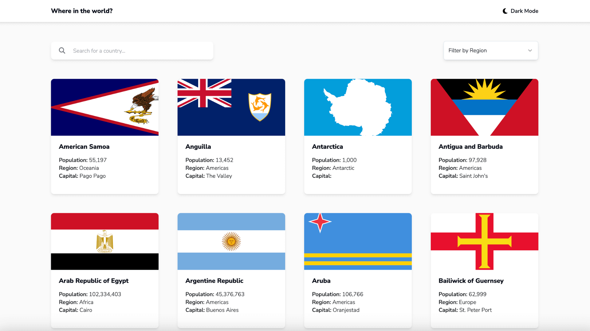

# Frontend Mentor - REST Countries API with color theme switcher solution

This is my Next.js TypeScript and Tailwind solution to the [REST Countries API with color theme switcher challenge on Frontend Mentor](https://www.frontendmentor.io/challenges/rest-countries-api-with-color-theme-switcher-5cacc469fec04111f7b848ca).

## Overview

I approached this challenge with a view to learning features released in [Next.js 14](https://nextjs.org/blog/next-14) as of November 2023.

### The challenge

Users should be able to:

- See all countries from the API on the homepage
- Search for a country using an `input` field
- Filter countries by region
- Click on a country to see more detailed information on a separate page
- Click through to the border countries on the detail page
- Toggle the color scheme between light and dark mode _(optional)_

### Screenshot Preview

### Links

- Live Site URL: [Live Demo](https://countries.adamrichardturner.dev)

### Built with

- [TypeScript](https://www.typescriptlang.org/)
- [React](https://reactjs.org/) - JS library
- [Next.js](https://nextjs.org/) - React framework
  -- App Router
  -- Server Components and Client Side Components
- [Tailwind CSS](https://tailwindcss.com/)
- [Shadcn](https://ui.shadcn.com/)
- [Framer Motion](https://www.framer.com/motion/animation/)
- [Intersection Observer API](https://developer.mozilla.org/en-US/docs/Web/API/Intersection_Observer_API) - For Infinite Scroll
